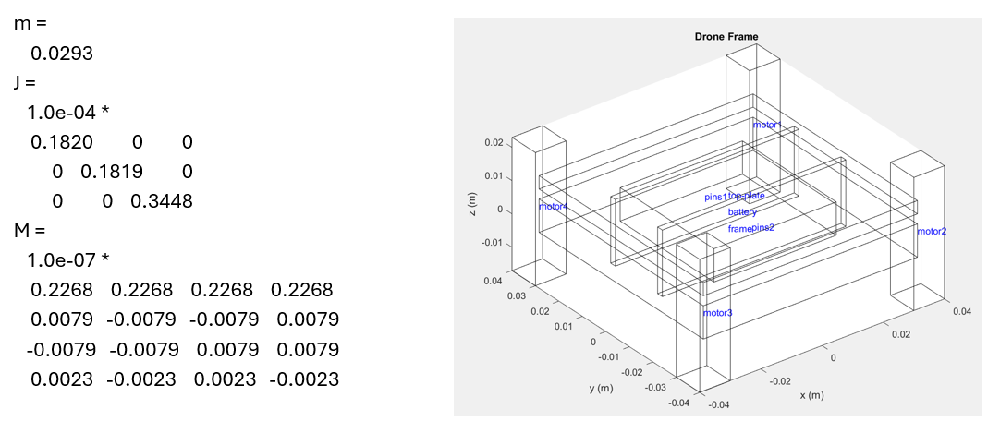
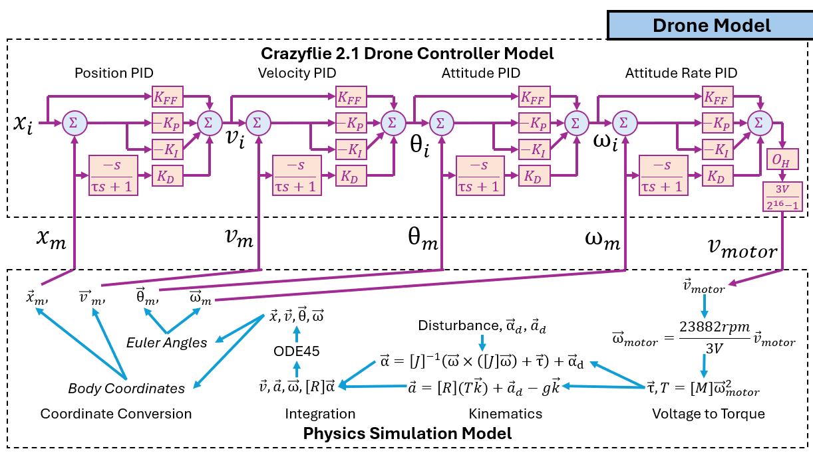
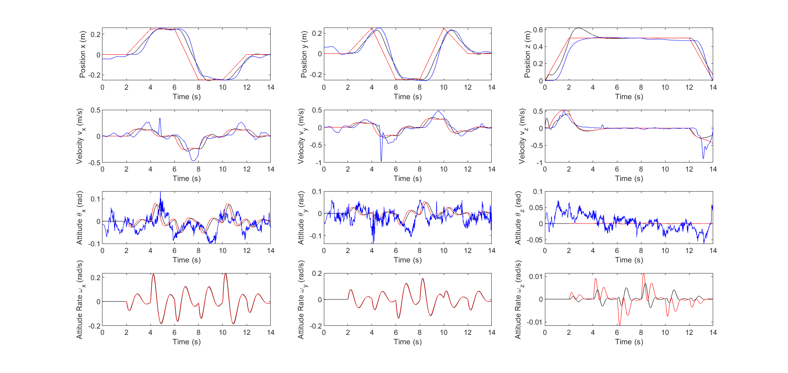
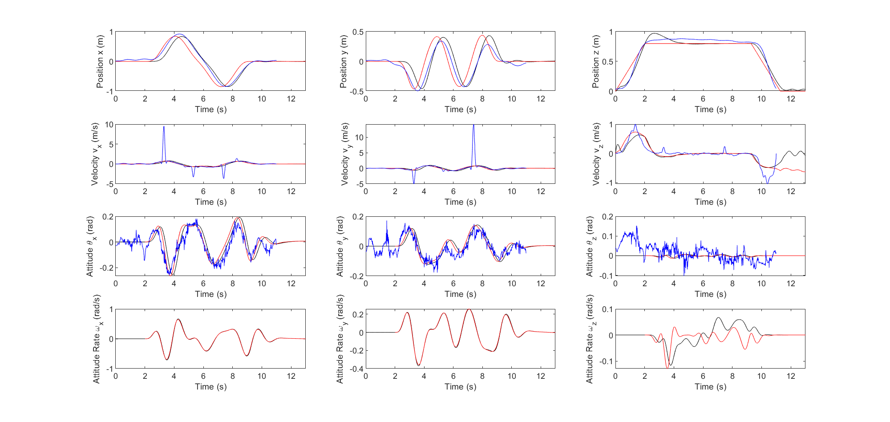

# quad_demo
This is the codebase for a ROS2 integration of a Crazyflie drone swarm built at RAIN Lab as well as an accompanying simulation model. The integration includes a ROS environment for a "server" and "client" node, both of which are written in Python. The simulation models the cascading PID controller on the Crazyflie [firmware](https://github.com/bitcraze/crazyflie-firmware/tree/master) and a rigid body similar to a standard Crazyflie 2.1 drone. This was developed by Kent Fukuda, Francisco Flores, Justin Chang, and Arshan Rezai.

## ROS Architecture

**Overview**


**Server** 

The server environment acts as a bridge between the Crazyflie API (cflib) used to communicate with the drones, a Vicon motion capturing system, and a ROS 2 node. The server ROS node is named "crazyflieServer", which subscribes to two topic: "Positioning" and "Commands", and publishes a topic called "Odometry". 

The Positioning topic allows clients to publish point positioning commands by using ROS position command message types. The server script will move the specified drone in the header.frame_id to the absolute world coordinates provided in the twist.linear structure. The Commands topic accepts a ROS string message type and is primarily used by the client to send utility commands, such as shutdown and save instructions. The list of commands that can be sent to this topic can be found [here](https://github.com/Rainlabuw/quad_demo/blob/main/Resources/codedocs.md).

For the Odometry topic, the server first extracts the location data of each drone from a UDP stream provided by the Vicon and sends it as external positioning information to the drones through through the cflib API. An onboard estimator applies a Kalman filter on the Vicon position and returns it to the server script via cflib logging. The state estimate position is then posted at regular intervals to the Odometry topic. The type of the Odometry topic is a ROS odometry message type.

**Client**

The client is used to send position and velocity commands to the drones via the crazyflie server bridge. Some sample client scripts and demos are uploaded to each date version of the code. For example, the 5.28.25 version includes the code for making one crazyflie drone follow another drone.

## Simulation Architecture

**Simulation Capabilities**

The simulation can model the 12 states of a Crazyflie 2.1 drone over time for a given initial stte, position trajectory, and disturbance. The trajectory specified may be a position setpoint, ramp, or a trajectory path. Disturbances can be modelled as well, which by default is set to Earth gravity (-gk). When run, the simulation will output the position trajectory, the deviation of the actual position from the trajectory, a time-resolved graph of each of the 12 states, and the motor output commands. Additionally, the simulation can calculate the J-matrix, M-matrix, and mass of the drone based on an Excel data sheet, which is described in the next section.

**Drone Model Parameters**

For the simulation to be accurate, the following parameters needed to be determined: the moment of inertia matrix J, drone mass m, mixing matrix M, and PID gains on the controller.

J, M, and m were manually found by disassembling a Crazyflie drone, weighing each component, and noting the dimensions and location of each component relative to the center of the drone. This was plugged into an [Excel data sheet](https://github.com/Rainlabuw/quad_demo/raw/refs/heads/main/Simulation_10.29.25/Drone%20Body.xlsx), which was fed into the simulation initialization function to calculate these physical parameters. The coefficient of lift and drag also needs to be found for the M matrix, which is based off of the PWM-to-thrust characterization made by Bitcraze, which can be found [here](https://www.bitcraze.io/documentation/repository/crazyflie-firmware/master/functional-areas/pwm-to-thrust/). Finally gains referenced the default parameters found in the Crazyflie firmware [settings](https://github.com/bitcraze/crazyflie-firmware/blob/master/src/platform/interface/platform_defaults_cf21bl.h).

The diagram below describes the calculation output for J, m, and M based on the above methods (SI units).



**Simulation Model**

The drone controller model in the simulation is based off Crazyflie's cascaded PID controller, for which the actual firmware implementation in the real-world drones can be found [here](https://github.com/bitcraze/crazyflie-firmware/blob/master/src/modules/src/controller/controller_pid.c). A replica of this controller was implemented in the file ```crazyflie_controller_model.m```. The position and velocity PIDs run at 100Hz, while the attitude and attitude rate PIDs run at 500Hz. The model implementation takes in the desired position (which can be a static waypoint, ramp, or a trajectory) specified by the user parameter argument, and outputs the motor voltage values, which is fed into the physics model.

The physics model runs with a minimum simulation step frequency that is five times greater than the highest PID frequency implemented in the simulation (2500Hz), and uses MATLAB's ode45 function to integrate. In this simulation, the position, velocity, and attitude are in the global reference frame, while the attitude rate is in the drone body frame. Note that the model uses an axis of rotation vector to express attitude coordinates, while the PID controllers use euler angles. 

Below is the block diagram describing the simulation implementation of the controller model, as well as the control flow of the physics model.



## Installation

1. For hardware, you will need to have several Crazyflie 2.1 drones, a Crazyflie antenna, a Vicon system, and a computer. For software you will need to install the [ROS 2 Humble Version](https://docs.ros.org/en/humble/index.html) and [Cflib](https://github.com/bitcraze/crazyflie-lib-python).
2. After the necessary hardware and software components are installed on the computer, [download](https://github.com/Rainlabuw/quad_demo/archive/refs/heads/main.zip) this repository and extract it. Next, extract the ZIP file in the location of your choosing.
3. Go to CodeBase/CF_ROS_Server/ros_ws/src/crazyfliebridge.py. On line 21, set the ```vicon_ip``` with the IP address of the system where the Vicon application is running. Then on line 16, add each crazyflie in the drone as a ```TrackingObect``` in the ```crazyflies``` list, as shown below. The ```TrackingObject``` constructor requires the radio path configured on the drone and the corresponding name set in the Vicon.
   ```python
        # Initialize Crazyflie server FIRST
        crazyflies = [
            TrackingObject( "radio://0/80/2M/E7E7E7E7E7", "crazyflie7" ),
            TrackingObject( "radio://0/80/2M/E7E7E7E7E8", "crazyflie8" ),
            TrackingObject( "radio://0/80/2M/E7E7E7E7E9", "crazyflie9" ),
        ]
        vicon_ip = "192.168.0.39"
   ```
4. Calibrate the Vicon. Add tracking balls to each drone in a unique pattern and place it in the area observed by the Vicon cameras. Then, in the Vicon application, create an object for each drone using the corresponding name set in the ```crazyflies``` list in step 3. For RAIN Lab members, refer to this document [here](https://docs.google.com/document/d/1kPrap9f_J5qDziwMAGIkX_GYJd9Y6tvxJGNkWcAp34A/edit?tab=t.0) for procedures specific to the lab Vicon.
5. Go to the CF_ROS_Server and set up a ROS2 workspace. For RAIN Lab and WAAR members, refer to this document [here](https://docs.google.com/document/d/13YHpbnyzi-Mv_tF_iOVWhIlhxdI17p3p2xsnSSq6-CQ/edit?tab=t.0#heading=h.tilbdy5z2c1m) for details.
6. The ROS Client does not need to be on the same computer as the server, but must be on the same network. Wherever you decide to place the client, follow the step 5. except with the CF_ROS_Client folder again to set up the ROS workspace.
   
## Setup & Operations

**Simulation**

1. Download files in the [Simulation_10.29.25](https://github.com/Rainlabuw/quad_demo/tree/main/Simulation_10.29.25) folder from this repository.
2. Extract the download, open ```simulation_script.m``` in MATLAB, and set MATLAB's directory to the same folder as the extracted folder.
3. Uncomment the example (or set up your own simulation) you want to model, then hit run in MATLAB's IDE.

**ROS Integration**

1. Turn on the Vicon system and connect all drones in the swarm to the computer via radio.
2. Open a terminal and cd to CF_ROS_Server/ros_ws. Then, run setup_instructions.sh.
3. Repeat the same for CF_ROS_Client.

## Updates

**10/29/2025 Simulation Verification**

The sample code contains several trajectories tested by the simulation. The same trajectories were given to the real-world Crazyflie system at RAIN Lab set up back in 5/28. The states from the simulation and physical model were compared. Trajectories for setpoint tracking and trajectory are shown below (red=desired, black=simulation, blue=physical). 





**5/28/2025 Drone Following Demo**

This sample code commands the E8 drone to follow in a pre-defined square trajectory, while the E7 drone will follow the drone solely based on the information given by the Odometry topic.


