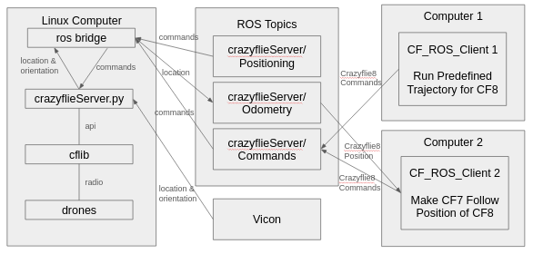
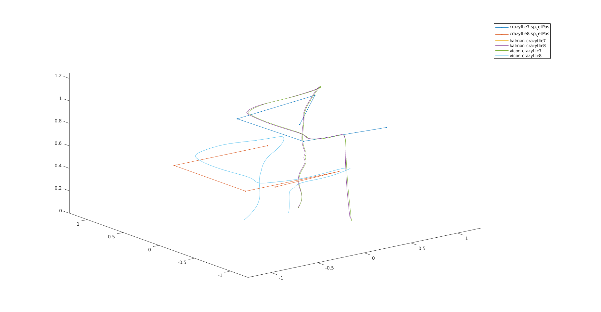

# quad_demo
This is the codebase for a ROS2 integration of a Crazyflie drone swarm built at RAIN Lab.The code includes a ROS environment for a "server" and "client", both of which are written in python.  This was developed by Kent Fukuda, Francisco Flores, Justin Chang, and Arshan Rezai. 
## Architecture

**Overview**



**Server** 

The server environment acts as a bridge between the Crazyflie API (cflib) used to communicate with the drones, a Vicon motion capturing system, and a ROS 2 node. The server ROS node is named "crazyflieServer", which subscribes to two topic: "Positioning" and "Commands", and publishes a topic called "Odometry". 

The Positioning topic allows clients to publish point positioning commands by using ROS position command message types. The server script will move the specified drone in the header.frame_id to the absolute world coordinates provided in the twist.linear structure. The Commands topic accepts a ROS string message type and is primarily used by the client to send utility commands, such as shutdown and save instructions. The list of commands that can be sent to this topic can be found [here](https://github.com/Rainlabuw/quad_demo/blob/main/Resources/codedocs.md).

For the Odometry topic, the server first extracts the location data of each drone from a UDP stream provided by the Vicon and sends it as external positioning information to the drones through through the cflib API. An onboard estimator applies a Kalman filter on the Vicon position and returns it to the server script via cflib logging. The state estimate position is then posted at regular intervals to the Odometry topic. The type of the Odometry topic is a ROS odometry message type.

**Client**

The client is used to send position and velocity commands to the drones via the crazyflie server bridge. Some sample client scripts and demos are uploaded to each date version of the code. For example, the 5.28.25 version includes the code for making one crazyflie drone follow another drone.

## Installation

1. For hardware, you will need to have several Crazyflie 2.1 drones, a Crazyflie antenna, a Vicon system, and a computer. For software you will need to install the [ROS 2 Humble Version](https://docs.ros.org/en/humble/index.html) and [Cflib](https://github.com/bitcraze/crazyflie-lib-python).
2. After the necessary hardware and software components are installed on the computer, [download](https://github.com/Rainlabuw/quad_demo/archive/refs/heads/main.zip) this repository and extract it. Next, extract the ZIP file in the location of your choosing.
3. Go to CodeBase/CF_ROS_Server/ros_ws/src/crazyfliebridge.py. On line 21, set the ```vicon_ip``` with the IP address of the system where the Vicon application is running. Then on line 16, add each crazyflie in the drone as a ```TrackingObect``` in the ```crazyflies``` list, as shown below. The ```TrackingObject``` constructor requires the radio path configured on the drone and the corresponding name set in the Vicon.
   ```python
        # Initialize Crazyflie server FIRST
        crazyflies = [
            TrackingObject( "radio://0/80/2M/E7E7E7E7E7", "crazyflie7" ),
            TrackingObject( "radio://0/80/2M/E7E7E7E7E8", "crazyflie8" ),
            TrackingObject( "radio://0/80/2M/E7E7E7E7E9", "crazyflie9" ),
        ]
        vicon_ip = "192.168.0.39"
   ```
4. Calibrate the Vicon. Add tracking balls to each drone in a unique pattern and place it in the area observed by the Vicon cameras. Then, in the Vicon application, create an object for each drone using the corresponding name set in the ```crazyflies``` list in step 3. For RAIN Lab members, refer to this document [here](https://docs.google.com/document/d/1kPrap9f_J5qDziwMAGIkX_GYJd9Y6tvxJGNkWcAp34A/edit?tab=t.0) for procedures specific to the lab Vicon.
5. Go to the CF_ROS_Server and set up a ROS2 workspace. For RAIN Lab and WAAR members, refer to this document [here](https://docs.google.com/document/d/13YHpbnyzi-Mv_tF_iOVWhIlhxdI17p3p2xsnSSq6-CQ/edit?tab=t.0#heading=h.tilbdy5z2c1m) for details.
6. The ROS Client does not need to be on the same computer as the server, but must be on the same network. Wherever you decide to place the client, follow the step 5. except with the CF_ROS_Client folder again to set up the ROS workspace.
   
## Setup & Operations

1. Turn on the Vicon system and connect all drones in the swarm to the computer via radio.
2. Open a terminal and cd to CF_ROS_Server/ros_ws. Then, run setup_instructions.sh.
3. Repeat the same for CF_ROS_Client.

## Updates

**5/28/25 Drone Following Demo**

This sample code commands the E8 drone to follow in a pre-defined square trajectory, while the E7 drone will follow the drone solely based on the information given by the Odometry topic.



